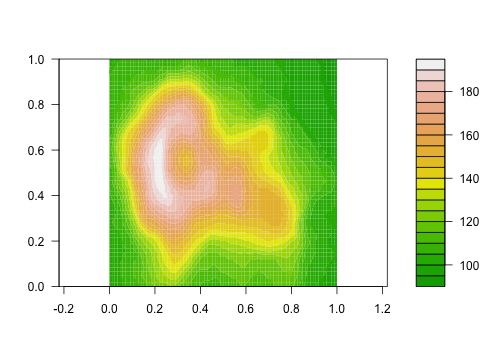
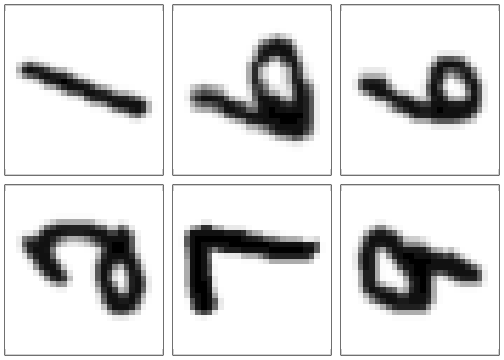

This vignette will illustrate the tuning of hyperparameters at two pre-processing steps provided by {tdarec}: the computation of persistent homology from data, and the vectorization of the resulting persistence data.
Because the logic and syntax can become confusing, the vignette will also illustrate how to tune model hyperparameters in the same workflow as those of the pre-processing recipe.[^precompile]

[^precompile]: Because hyperparameter tuning is time-consuming, this vignette is pre-compiled before the package is built, to reduce CRAN checktime in particular.


``` r
library(tidymodels)
#> ── Attaching packages ────────────────────────────────────── tidymodels 1.3.0 ──
#> ✔ broom        1.0.8     ✔ tibble       3.2.1
#> ✔ ggplot2      3.5.2     ✔ tidyr        1.3.1
#> ✔ infer        1.0.8     ✔ tune         1.3.0
#> ✔ modeldata    1.4.0     ✔ workflows    1.2.0
#> ✔ parsnip      1.3.1     ✔ workflowsets 1.1.0
#> ✔ purrr        1.0.4     ✔ yardstick    1.3.2
#> ✔ rsample      1.3.0
#> ── Conflicts ───────────────────────────────────────── tidymodels_conflicts() ──
#> ✖ purrr::discard() masks scales::discard()
#> ✖ dplyr::filter()  masks stats::filter()
#> ✖ dplyr::lag()     masks stats::lag()
#> ✖ tdarec::step()   masks recipes::step(), stats::step()
#> • Use suppressPackageStartupMessages() to eliminate package startup messages
library(tdarec)
```

## cubical persistent homology

The persistent homology (PH) of a real-valued function on a manifold is determined by the _sublevel set filtration_:
Given $f : X \to \mathbb{R}$, for each value $r \in \mathbb{R}$ define $X_r = f^{-1}(-\infty,r]$, so that $X_r \subseteq X_s$ whenever $r < s$.
Then the induced homomorphisms $H_k(X_r) \to H_k(X_s)$ between (singular) homology groups form a _persistence module_ whose decomposition obtains the birth--death pairs that comprise the $k^\text{th}$ persistence diagram of $X$.

While some such computations can be done analytically, most data come in the form of discrete measurements rather than functional relationships.
For example, the topographic data for the Maunga Whau caldera take the form of a 2-dimensional numeric array, with each cell containing the estimated elevation of a 100--square meter area:


``` r
filled.contour(volcano, color.palette = terrain.colors, asp = 1)
```



This is a discretization of a height function from latitude and longitude ($\mathbb{S}^2$, approximated locally by $\mathbb{R}^2$) to elevation ($\mathbb{R}$), and cubical persistent homology is an alternative to the simplicial computation designed specifically for data in this form.
The {ripserr} package ports the Cubical Ripser algorithm to R and serves as the engine for this pre-processing step.

## handwritten digits data

The [MNIST handwritten digits data set](https://en.wikipedia.org/wiki/MNIST_database) comprises 70,000 $28 \times 28$ pixellated black-and-white images of the numerals 0--9 obtained from forms completed by US Census Bureau field staff and Maryland high school students.
The images are partitioned into a training set of 60,000 and a testing set of 10,000, and {tdavec} comes with a 1% random sample from each.
For example, here are the first six digits, labeled $1, 6, 6, 2, 7, 9$:


``` r
par(mfrow = c(2, 3), mar = c(.5, .5, .5, .5))
for (r in seq(6)) {
  image(
    mnist_train$digit[[r]],
    col = grey.colors(256, start = 0, end = 1, rev = TRUE),
    xaxt = "n", yaxt = "n", asp = 1
  )
}
```



``` r
par(mfrow = c(1, 1), mar = c(5, 4, 4, 2) + 0.1)
```

(That the digits are rotated from their usual orientation is not a problem for the methods used here.)
To respect Tidymodels conventions, we convert the `label` column from integer to factor before continuing.


``` r
mnist_train$label <- factor(mnist_train$label, sort(unique(mnist_train$label)))
mnist_test$label <- factor(mnist_test$label, sort(unique(mnist_test$label)))
```

## preparation

Following a standard ML approach, we prepare the training set for 6-fold cross-validation, which will be used to choose hyperparameter settings that maximize the accuracy of a classifier.
The optimized settings will be used to classify the digits in the testing set, and a comparison with the true labels will provide an estimate of the accuracy of the resulting model.


``` r
(mnist_folds <- vfold_cv(mnist_train, v = 6))
#> #  6-fold cross-validation 
#> # A tibble: 6 × 2
#>   splits            id   
#>   <list>            <chr>
#> 1 <split [500/100]> Fold1
#> 2 <split [500/100]> Fold2
#> 3 <split [500/100]> Fold3
#> 4 <split [500/100]> Fold4
#> 5 <split [500/100]> Fold5
#> 6 <split [500/100]> Fold6
```

For reference, we check the range of the values that populate the arrays:


``` r
print(range(unlist(mnist_train$digit)))
#> [1]   0 255
```

This indicates that the greyscale images are coded as integers between $0$ and $2^8 - 1$, and we will use this information to inform our pre-processing steps.

# a fixed-parameter walkthrough

Before taking on the challenge of tuning, we walk through the modeling process using fixed parameters. This will help ensure that our approach is sound, for example by prompting us to think through our choices and flagging unforeseen problems.
It will also allow us to compare the performance of the model under "trialed" versus tuned parameter settings.

## pre-processing recipe

The first step is to prepare the pre-processing recipe.
Ours goes in three steps: Blur the original images, compute their cubical persistence diagrams, and transform these diagrams into vectorized persistence landscapes.
We comment on each step:

1. One limitation of cubical persistent homology is that it is sensitive only to the height difference between cells in the array, not the distances between them; see [Kaji, Sudo, & Ahara (2020)](http://arxiv.org/abs/2005.12692) for a detailed discussion. So, on topographic data, a steep peak and a gentle mound of the same height will be encoded as the same feature.
This is likely to be a problem in the classification of digits, as for example the numerals $0$ and $6$ have one "hole" each so are indistinguishable from a purely topological perspective. We can make the PH sensitive to distance by first convolving the image with a small bivariate Gaussian distribution. This _blur_ reduces the height difference between nearby positions but retains that between distant positions. For this untuned model, we allow `step_blur()` to compute a default standard deviation for the Gaussian as described in `help(blur)`.
2. Cubical persistent homology is a parameter-free computation, so no tuning is required or even possible. (With point clouds, we might care about the highest-degree features being computed, but for our height functions on $\mathbb{R}^2$ the upper bound for non-zero homology is $2 - 1 = 1$.)
3. {TDAvec} provides over a dozen vectorization methods for persistence diagrams, and each carries strengths and weaknesses. Our choice to use persistence landscapes in this vignette is somewhat arbitrary, but the nuance of the step allows us to illustrate optimization using two hyperparameters (the homological degree of the diagram to transform and the number of landscape levels to vectorize) and to point out some adjustable default behavior. We use our knowledge of the value range to specify a grid.

Only the final pre-processing step yields new numeric columns that can be used as predictors in a conventional model.
For this reason, the PH step by default assigns the placeholder role `"persistence diagram"` to its output, so that the transformed column will not accidentally be used as a predictor.
In contrast, the blur step modifies its column `digit` in place, and [the modified column inherits the role(s) of the original](https://recipes.tidymodels.org/articles/Roles.html#role-inheritance).
This requires us to update the role of `digit`, but this can be done before or after applying the blur.


``` r
recipe(mnist_train) |> 
  update_role(label, new_role = "outcome") |> 
  update_role(digit, new_role = "image") |> 
  step_blur(digit) |>
  step_pd_raster(digit) |> 
  step_vpd_persistence_landscape(
    digit,
    hom_degree = 1,
    xmin = 0, xmax = 255, xby = 16,
    num_levels = 3
  ) |> 
  print() -> mnist_rec
#> 
#> ── Recipe ──────────────────────────────────────────────────────────────────────
#> 
#> ── Inputs
#> Number of variables by role
#> outcome: 1
#> image:   1
#> 
#> ── Operations
#> • Gaussian blurring of: digit
#> • persistent features from a cubical filtration of: digit
#> • persistence landscape of: digit
```

We can check directly whether our role assignments obtained as expected:


``` r
mnist_rec |> 
  prep() |> 
  print() -> mnist_prep
#> 
#> ── Recipe ──────────────────────────────────────────────────────────────────────
#> 
#> ── Inputs
#> Number of variables by role
#> outcome: 1
#> image:   1
#> 
#> ── Training information
#> Training data contained 600 data points and no incomplete rows.
#> 
#> ── Operations
#> • Gaussian blurring of: <none> | Trained
#> • persistent features from a cubical filtration of: <none> | Trained
#> • persistence landscape of: <none> | Trained
summary(mnist_prep)
#> # A tibble: 50 × 4
#>    variable     type      role      source  
#>    <chr>        <list>    <chr>     <chr>   
#>  1 digit        <chr [1]> image     original
#>  2 label        <chr [3]> outcome   original
#>  3 digit_pl_1_1 <chr [2]> predictor derived 
#>  4 digit_pl_1_2 <chr [2]> predictor derived 
#>  5 digit_pl_1_3 <chr [2]> predictor derived 
#>  6 digit_pl_1_4 <chr [2]> predictor derived 
#>  7 digit_pl_1_5 <chr [2]> predictor derived 
#>  8 digit_pl_1_6 <chr [2]> predictor derived 
#>  9 digit_pl_1_7 <chr [2]> predictor derived 
#> 10 digit_pl_1_8 <chr [2]> predictor derived 
#> # ℹ 40 more rows
```

And we can inspect the result of applying the prepared recipe to the training data:


``` r
mnist_rec |> 
  prep() |> 
  bake(new_data = mnist_train)
#> # A tibble: 600 × 50
#>    digit  label digit_pl_1_1 digit_pl_1_2 digit_pl_1_3 digit_pl_1_4 digit_pl_1_5
#>    <list> <fct>        <dbl>        <dbl>        <dbl>        <dbl>        <dbl>
#>  1 <PHom> 1                0            0         3.15       20.2          24.4 
#>  2 <PHom> 6                0            0         0           0             3.87
#>  3 <PHom> 6                0            0         0           0            13.4 
#>  4 <PHom> 2                0            0         0           0            15.5 
#>  5 <PHom> 7                0            0         0           0             0   
#>  6 <PHom> 9                0            0         0           0            10.0 
#>  7 <PHom> 2                0            0         5.49       22.5          39.5 
#>  8 <PHom> 0                0            0         0           0.233        16.1 
#>  9 <PHom> 4                0            0         0           9.77         26.8 
#> 10 <PHom> 3                0            0         0           1.05         18.1 
#> # ℹ 590 more rows
#> # ℹ 43 more variables: digit_pl_1_6 <dbl>, digit_pl_1_7 <dbl>,
#> #   digit_pl_1_8 <dbl>, digit_pl_1_9 <dbl>, digit_pl_1_10 <dbl>,
#> #   digit_pl_1_11 <dbl>, digit_pl_1_12 <dbl>, digit_pl_1_13 <dbl>,
#> #   digit_pl_1_14 <dbl>, digit_pl_1_15 <dbl>, digit_pl_1_16 <dbl>,
#> #   digit_pl_2_1 <dbl>, digit_pl_2_2 <dbl>, digit_pl_2_3 <dbl>,
#> #   digit_pl_2_4 <dbl>, digit_pl_2_5 <dbl>, digit_pl_2_6 <dbl>, …
```

## classification forest

In the next code chunk we specify a random forest (RF) model to classify the digits using vectorized persistence landscapes.
RFs are ubiquitous in ML for their combination of flexibility and performance: They can be used almost anywhere and generally produce more models that are competitive with or superior to classical models like decision trees and generalized linear models.
They also come with a medley of tuning parameters. In this vignette, we demonstrate the use of 3 hyperparameters, each treated differently:

* The number `trees` of trees in each forest is fixed at 300.
* The minimum node size will be tuned across its default range, though here it is fixed at 6.
* The number of predictors selected for each tree will also be tuned, but the maximum value must be determined from the data. Here it is set to 2.

The {randomForest} engine is strict in its requirements: If all predictors have zero variance, i.e. there is no way to generate different predictors for different cases, then the model fails with an error.
This is a serious possibility for our setting, for instance if no degree-1 features are detected so that the persistence landscapes are uniformly zero.
To prevent this from derailing our workflow, we use the {ranger} engine, which is tolerant of this situation, instead.


``` r
rand_forest(
  trees = 300,
  min_n = 6,
  mtry = 2
) |> 
  set_mode("classification") |> 
  set_engine("ranger") |> 
  print() -> mnist_spec
#> Random Forest Model Specification (classification)
#> 
#> Main Arguments:
#>   mtry = 2
#>   trees = 300
#>   min_n = 6
#> 
#> Computational engine: ranger
```

## fitting and evaluation

We fit the model to the pre-processed training data:


``` r
fit(
  mnist_spec,
  mnist_rec |> prep() |> formula(),
  data = mnist_rec |> prep() |> bake(new_data = mnist_train)
) |> 
  print() -> mnist_fit
#> parsnip model object
#> 
#> Ranger result
#> 
#> Call:
#>  ranger::ranger(x = maybe_data_frame(x), y = y, mtry = min_cols(~2,      x), num.trees = ~300, min.node.size = min_rows(~6, x), num.threads = 1,      verbose = FALSE, seed = sample.int(10^5, 1), probability = TRUE) 
#> 
#> Type:                             Probability estimation 
#> Number of trees:                  300 
#> Sample size:                      600 
#> Number of independent variables:  48 
#> Mtry:                             2 
#> Target node size:                 6 
#> Variable importance mode:         none 
#> Splitrule:                        gini 
#> OOB prediction error (Brier s.):  0.784527
```

Note that the model, while not optimized for accuracy on the training set, is informed by it through the preparation process, in particular the default choice of blur parameter:


``` r
mnist_prep$steps[[1]]$blur_sigmas
#> digit 
#>   3.5
```

To evaluate the model, we generate predictions for the testing set and compare them to the true labels.
Because accuracy is a coarse metric for a 10-value classification task, we examine the confusion matrix to get a sense of what errors are most common.


``` r
mnist_fit |> 
  predict(new_data = bake(prep(mnist_rec), new_data = mnist_test)) |> 
  bind_cols(select(mnist_test, label)) |> 
  print() -> mnist_pred
#> # A tibble: 100 × 2
#>    .pred_class label
#>    <fct>       <fct>
#>  1 7           0    
#>  2 2           1    
#>  3 1           4    
#>  4 1           1    
#>  5 1           2    
#>  6 2           0    
#>  7 1           4    
#>  8 6           9    
#>  9 3           6    
#> 10 7           0    
#> # ℹ 90 more rows
mnist_pred |> 
  conf_mat(truth = label, estimate = .pred_class)
#>           Truth
#> Prediction 0 1 2 3 4 5 6 7 8 9
#>          0 1 0 2 4 0 1 0 2 0 0
#>          1 0 7 1 0 4 2 0 0 0 0
#>          2 2 1 1 0 0 0 1 0 0 0
#>          3 0 0 0 1 0 1 2 0 2 0
#>          4 0 1 1 1 6 1 0 0 1 0
#>          5 0 0 0 0 0 1 0 0 0 0
#>          6 1 0 3 1 0 0 1 2 3 3
#>          7 5 1 0 3 0 4 2 2 1 5
#>          8 0 0 2 0 0 0 4 0 3 1
#>          9 1 0 0 0 0 0 0 4 0 1
mnist_pred |> 
  accuracy(truth = label, estimate = .pred_class)
#> # A tibble: 1 × 3
#>   .metric  .estimator .estimate
#>   <chr>    <chr>          <dbl>
#> 1 accuracy multiclass      0.24
```

The accuracy is poor but clearly better than chance. The confusion matrix suggests some reasons for the misclassifications, in that the most commonly confused digits are _not_ those with the same degree-1 homology; they are more geometrically than topologically similar.
This could be due to excessive blur; the standard deviation of 3.5 may be too high. We can compare this default to the value obtained through tuning.

# tuning hyperparameters

We now extend the process above to choose, bound, and tune several pre-processing and modeling hyperparameters.

## tunable pre-processing recipe

We rewrite the recipe to prepare the hyperparameters for tuning rather than to assign them fixed values.
Each parameter is given a character ID that will refer to it in the various system messages and outputs.
Beware that this section of the vignette overwrites all `mnist_*` variable names used in the previous section! This is for readability but can cause problems if parts are executed out of order.


``` r
recipe(mnist_train) |> 
  update_role(label, new_role = "outcome") |> 
  update_role(digit, new_role = "image") |> 
  step_blur(digit, blur_sigmas = tune("blur_sd")) |>
  step_pd_raster(digit) |> 
  step_vpd_persistence_landscape(
    digit,
    hom_degree = tune("pl_deg"),
    xmin = 0, xmax = 255, xby = 16,
    num_levels = tune("pl_lev")
  ) |> 
  print() -> mnist_rec
#> 
#> ── Recipe ──────────────────────────────────────────────────────────────────────
#> 
#> ── Inputs
#> Number of variables by role
#> outcome: 1
#> image:   1
#> 
#> ── Operations
#> • Gaussian blurring of: digit
#> • persistent features from a cubical filtration of: digit
#> • persistence landscape of: digit
```

This recipe has three tunable parameters, as we can verify by extracting their dials:


``` r
( rec_dials <- extract_parameter_set_dials(mnist_rec) )
#> Collection of 3 parameters for tuning
#> 
#>  identifier        type    object
#>     blur_sd blur_sigmas nparam[?]
#>      pl_deg  hom_degree nparam[?]
#>      pl_lev  num_levels nparam[?]
#> 
#> Recipe parameters needing finalization:
#> Gaussian Blur std. dev.s ('blur_sd') , Homological Degree ('pl_deg') , and #
#> Levels or envelopes ('pl_lev')
#> 
#> See `?dials::finalize()` or `?dials::update.parameters()` for more information.
```

Note that all three require finalization; like the number of randomly sampled predictors for each tree in a random forest, their ranges should not be guessed but must be determined from the content of the data.
In fact, the persistence landscape hyperparameters must be determined from columns derived by the first two steps from the input columns, not from the input columns themselves.
For this reason only, we train the recipe with some intuitive values in order to obtain these derived columns for tuning purposes:


``` r
mnist_rec |> 
  finalize_recipe(parameters = list(blur_sd = 8, pl_deg = 0, pl_lev = 3)) |> 
  prep() |> 
  bake(new_data = mnist_train) ->
  mnist_bake
print(mnist_bake)
#> # A tibble: 600 × 50
#>    digit  label digit_pl_1_1 digit_pl_1_2 digit_pl_1_3 digit_pl_1_4 digit_pl_1_5
#>    <list> <fct>        <dbl>        <dbl>        <dbl>        <dbl>        <dbl>
#>  1 <PHom> 1                0         5.19         0            0               0
#>  2 <PHom> 6                0         0            3.85         8.77            0
#>  3 <PHom> 6                0         0           15.2          0               0
#>  4 <PHom> 2                0         0            0           13.2             0
#>  5 <PHom> 7                0         0            5.33         3.96            0
#>  6 <PHom> 9                0         0            7.97        11.3             0
#>  7 <PHom> 2                0         0            6.87         0               0
#>  8 <PHom> 0                0         0            9.98         0               0
#>  9 <PHom> 4                0         0            5.14         0               0
#> 10 <PHom> 3                0         0           11.1          0               0
#> # ℹ 590 more rows
#> # ℹ 43 more variables: digit_pl_1_6 <dbl>, digit_pl_1_7 <dbl>,
#> #   digit_pl_1_8 <dbl>, digit_pl_1_9 <dbl>, digit_pl_1_10 <dbl>,
#> #   digit_pl_1_11 <dbl>, digit_pl_1_12 <dbl>, digit_pl_1_13 <dbl>,
#> #   digit_pl_1_14 <dbl>, digit_pl_1_15 <dbl>, digit_pl_1_16 <dbl>,
#> #   digit_pl_2_1 <dbl>, digit_pl_2_2 <dbl>, digit_pl_2_3 <dbl>,
#> #   digit_pl_2_4 <dbl>, digit_pl_2_5 <dbl>, digit_pl_2_6 <dbl>, …
```

We use the input `digit` column to finalize the range of blurs and the derived `digit` column to finalize the range of homological degree.
We expect the important topological features of the digits number at most 2 per image, so we manually prescribe a narrow range for `num_levels`, though it could also be learned from the training set.
Each finalized range is printed for reference:


``` r
( blur_sd_fin <- finalize(blur_sigmas(), mnist_train |> select(digit)) )
#> Gaussian Blur std. dev.s (quantitative)
#> Transformer: log1p [-1, Inf]
#> Range (transformed scale): [0.504, 2.5]
( pl_deg_fin <- finalize(hom_degree(), mnist_bake |> select(digit)) )
#> Homological Degree (quantitative)
#> Range: [0, 1]
( pl_lev_fin <- num_levels(range = c(1, 3)) )
#> # Levels or envelopes (quantitative)
#> Range: [1, 3]
```

Note that the homological degree ranges only from $0$ to $1$ because the image has dimension 2.

## tunable classification forest

As noted earlier, the three hyperparameters of the RF specification will be treated in different ways: `trees` fixed at $300$, `min_n` tuned over a default grid, and `mtry` tuned over a grid learned from the training set.


``` r
rand_forest(
  trees = 300,
  min_n = tune("rf_node"),
  mtry = tune("rf_pred")
) |> 
  set_mode("classification") |> 
  set_engine("ranger") |> 
  print() -> mnist_spec
#> Random Forest Model Specification (classification)
#> 
#> Main Arguments:
#>   mtry = tune("rf_pred")
#>   trees = 300
#>   min_n = tune("rf_node")
#> 
#> Computational engine: ranger
```

We can again check for the two tunable hyperparameters by extracting their dials:


``` r
( spec_dials <- extract_parameter_set_dials(mnist_spec) )
#> Collection of 2 parameters for tuning
#> 
#>  identifier  type    object
#>     rf_pred  mtry nparam[?]
#>     rf_node min_n nparam[+]
#> 
#> Model parameters needing finalization:
#> # Randomly Selected Predictors ('rf_pred')
#> 
#> See `?dials::finalize()` or `?dials::update.parameters()` for more information.
```

As seen in the printed dials, one hyperparameter range must be finalized.
The process for doing so is the same as for the recipe, but in this case the variables of interest are the vectorized features.
We see from the pre-processed data that these features use a consistent naming convention, and we use this convention to select them for learning the range:


``` r
( mtry_fin <- finalize(mtry(), mnist_bake |> select(contains("_pl_"))) )
#> # Randomly Selected Predictors (quantitative)
#> Range: [1, 48]
```

## hyperparameter tuning

At last we arrive at the crux of this vignette!
In preparation for tuning, we wrap the pre-processing recipe and the model specification in a workflow:


``` r
workflow() |> 
  add_recipe(mnist_rec) |> 
  add_model(mnist_spec) |> 
  print() -> mnist_wflow
#> ══ Workflow ════════════════════════════════════════════════════════════════════
#> Preprocessor: Recipe
#> Model: rand_forest()
#> 
#> ── Preprocessor ────────────────────────────────────────────────────────────────
#> 3 Recipe Steps
#> 
#> • step_blur()
#> • step_pd_raster()
#> • step_vpd_persistence_landscape()
#> 
#> ── Model ───────────────────────────────────────────────────────────────────────
#> Random Forest Model Specification (classification)
#> 
#> Main Arguments:
#>   mtry = tune("rf_pred")
#>   trees = 300
#>   min_n = tune("rf_node")
#> 
#> Computational engine: ranger
```

One way to systematically optimize the recipe and model hyperparameters---to tune the dials---is via a grid.
This can be important when the parameters have known trade-offs or the objective function is expected to have multiple optima, so the investigator wants a course-grained "map" of how performance varies across the whole parameter space.
For illustration, we construct a workflow grid by crossing a recipe grid with a model grid:


``` r
mnist_rec_grid <- 
  grid_regular(blur_sd_fin, pl_deg_fin, pl_lev_fin, levels = 3) |> 
  set_names(c("blur_sd", "pl_deg", "pl_lev"))
mnist_spec_grid <- 
  grid_regular(min_n(), mtry_fin, levels = 3) |> 
  set_names(c("rf_node", "rf_pred"))
mnist_grid <- merge(mnist_rec_grid, mnist_spec_grid)
head(mnist_grid)
#>      blur_sd pl_deg pl_lev rf_node rf_pred
#> 1  0.6554575      0      1       2       1
#> 2  3.5000000      0      1       2       1
#> 3 11.2322682      0      1       2       1
#> 4  0.6554575      1      1       2       1
#> 5  3.5000000      1      1       2       1
#> 6 11.2322682      1      1       2       1
```

This approach is not as inefficient as it might seem:
As implemented in Tidymodels, [grid tuning recognizes the order of the pre-processing steps](https://tune.tidymodels.org/articles/extras/optimizations.html), and sometimes [of the model construction](https://www.tidymodels.org/learn/work/tune-text/#grid-search), and only performs each step once for every combination of subsequent steps, using the temporarily stored results rather than recomputing them from scratch.
The unexecuted code chunk below shows the syntax for conducting this grid search:


``` r
mnist_res <- tune_grid(
  mnist_wflow,
  resamples = mnist_folds,
  grid = mnist_grid,
  metrics = metric_set(accuracy, roc_auc),
  control = control_grid()
)
```

Still, however, due to the exceptionally costly computations involved, a more targeted search is preferable.
For this reason, [Motta, Tralie, &al (2019)](https://ieeexplore.ieee.org/abstract/document/8999182) recommend Bayesian optimization for ML using topological features. This procedure is also implemented in Tidymodels and executed below.
First, we combine the extracted dials from the pre-processing recipe and the model specification and update them with the finalized ranges:


``` r
wflow_dials <- bind_rows(rec_dials, spec_dials) |> 
  update(blur_sd = blur_sd_fin, pl_deg = pl_deg_fin, pl_lev = pl_lev_fin) |> 
  update(rf_pred = mtry_fin)
```

The tuning syntax is similar to that of the grid search, but in place of the grid we only provide the updated dials.
We specify 6 initial seeds with 12 tuning iterations each.


``` r
mnist_res <- tune_bayes(
  mnist_wflow,
  resamples = mnist_folds,
  param_info = wflow_dials,
  metrics = metric_set(accuracy, roc_auc),
  initial = 6, iter = 12
)
#> → A | warning: ! 19 columns were requested but there were 16 predictors in the data.
#>                ℹ 16 predictors will be used.
#> 
There were issues with some computations   A: x1

→ B | warning: ! 48 columns were requested but there were 32 predictors in the data.
#>                ℹ 32 predictors will be used.
#> There were issues with some computations   A: x1

There were issues with some computations   A: x1   B: x1

→ C | warning: ! 38 columns were requested but there were 16 predictors in the data.
#>                ℹ 16 predictors will be used.
#> There were issues with some computations   A: x1   B: x1

There were issues with some computations   A: x1   B: x1   C: x1

There were issues with some computations   A: x2   B: x1   C: x1

There were issues with some computations   A: x2   B: x2   C: x1

There were issues with some computations   A: x2   B: x2   C: x2

There were issues with some computations   A: x3   B: x2   C: x2

There were issues with some computations   A: x3   B: x3   C: x2

There were issues with some computations   A: x3   B: x3   C: x3

There were issues with some computations   A: x4   B: x3   C: x3

There were issues with some computations   A: x4   B: x4   C: x3

There were issues with some computations   A: x4   B: x4   C: x4

There were issues with some computations   A: x5   B: x4   C: x4

There were issues with some computations   A: x5   B: x5   C: x4

There were issues with some computations   A: x5   B: x5   C: x5

There were issues with some computations   A: x6   B: x5   C: x5

There were issues with some computations   A: x6   B: x6   C: x5

There were issues with some computations   A: x6   B: x6   C: x6
! The Gaussian process model is being fit using 5 features but only has 6
#>   data points to do so. This may cause errors or a poor model fit.
#> 
→ D | warning: ! 22 columns were requested but there were 16 predictors in the data.
#>                ℹ 16 predictors will be used.
#> There were issues with some computations   A: x6   B: x6   C: x6

There were issues with some computations   A: x6   B: x6   C: x6   D: x1

There were issues with some computations   A: x6   B: x6   C: x6   D: x2

There were issues with some computations   A: x6   B: x6   C: x6   D: x3

There were issues with some computations   A: x6   B: x6   C: x6   D: x4

There were issues with some computations   A: x6   B: x6   C: x6   D: x5

There were issues with some computations   A: x6   B: x6   C: x6   D: x6

→ E | warning: ! 39 columns were requested but there were 16 predictors in the data.
#>                ℹ 16 predictors will be used.
#> There were issues with some computations   A: x6   B: x6   C: x6   D: x6

There were issues with some computations   A: x6   B: x6   C: x6   D: x6   E: x1

There were issues with some computations   A: x6   B: x6   C: x6   D: x6   E: x2

There were issues with some computations   A: x6   B: x6   C: x6   D: x6   E: x3

There were issues with some computations   A: x6   B: x6   C: x6   D: x6   E: x4

There were issues with some computations   A: x6   B: x6   C: x6   D: x6   E: x5

There were issues with some computations   A: x6   B: x6   C: x6   D: x6   E: x6

There were issues with some computations   A: x6   B: x6   C: x6   D: x6   E: x6
```

Whereas in the previous section we fit only a single model, in this section we have obtained results for numerous hyperparameter settings and must choose among them for the final model.
We first inspect the top several models, for a sense of how rapidly performance drops away from the optimal settings, then select the top-performing settings for the final model.
We computed both accuracy and area under the ROC curve, but we use only the former to inform this choice.


``` r
collect_metrics(mnist_res) |> 
  filter(.metric == "accuracy") |> 
  arrange(desc(mean))
#> # A tibble: 18 × 12
#>    blur_sd pl_deg pl_lev rf_pred rf_node .metric  .estimator  mean     n std_err
#>      <dbl>  <int>  <int>   <int>   <int> <chr>    <chr>      <dbl> <int>   <dbl>
#>  1   0.910      0      3       5      23 accuracy multiclass 0.465     6 0.0159 
#>  2   0.925      0      3      11       8 accuracy multiclass 0.462     6 0.0162 
#>  3   0.941      0      3       5      21 accuracy multiclass 0.45      6 0.0110 
#>  4   0.805      0      3       9      20 accuracy multiclass 0.443     6 0.0189 
#>  5   1.14       0      3      42      40 accuracy multiclass 0.418     6 0.00792
#>  6   0.697      0      3      39       7 accuracy multiclass 0.408     6 0.0189 
#>  7   0.885      0      1      39       4 accuracy multiclass 0.403     6 0.0109 
#>  8   0.655      0      1      19      17 accuracy multiclass 0.385     6 0.015  
#>  9   4.50       0      3      10      32 accuracy multiclass 0.372     6 0.0160 
#> 10   1.57       0      2      11      16 accuracy multiclass 0.33      6 0.0113 
#> 11   1.88       0      1      22      40 accuracy multiclass 0.297     6 0.0120 
#> 12   3.42       0      2       2      18 accuracy multiclass 0.292     6 0.0223 
#> 13   2.68       1      2      48      40 accuracy multiclass 0.272     6 0.0185 
#> 14   9.83       0      3      16      19 accuracy multiclass 0.238     6 0.00872
#> 15   6.20       0      1       5      21 accuracy multiclass 0.23      6 0.0153 
#> 16   1.47       1      3      29       2 accuracy multiclass 0.228     6 0.00946
#> 17  11.2        0      1      38       9 accuracy multiclass 0.18      6 0.0169 
#> 18   7.20       1      2       1      24 accuracy multiclass 0.122     6 0.0158 
#> # ℹ 2 more variables: .config <chr>, .iter <int>
(mnist_best <- select_best(mnist_res, metric = "accuracy"))
#> # A tibble: 1 × 6
#>   blur_sd pl_deg pl_lev rf_pred rf_node .config
#>     <dbl>  <int>  <int>   <int>   <int> <chr>  
#> 1   0.910      0      3       5      23 Iter10
```

## fitting and evaluation

Now, finally, we fit the tuned model to the training set:


``` r
mnist_fin <- prep(finalize_recipe(mnist_rec, mnist_best))
fit(
  finalize_model(mnist_spec, mnist_best),
  formula(mnist_fin),
  data = bake(mnist_fin, new_data = mnist_train)
) |> 
  print() -> mnist_fit
#> parsnip model object
#> 
#> Ranger result
#> 
#> Call:
#>  ranger::ranger(x = maybe_data_frame(x), y = y, mtry = min_cols(~5L,      x), num.trees = ~300, min.node.size = min_rows(~23L, x),      num.threads = 1, verbose = FALSE, seed = sample.int(10^5,          1), probability = TRUE) 
#> 
#> Type:                             Probability estimation 
#> Number of trees:                  300 
#> Sample size:                      600 
#> Number of independent variables:  48 
#> Mtry:                             5 
#> Target node size:                 23 
#> Variable importance mode:         none 
#> Splitrule:                        gini 
#> OOB prediction error (Brier s.):  0.532131
```

The resulting RF correctly classifies roughly half of the images "out of bag"---not great, but much better than the model using intuited hyperparameter values (and than pure chance).
(Note also that the `blur` standard deviation is lower than originally defaulted to.)
As before, we can look to the confusion matrix for insights into the sources of error:


``` r
mnist_fit |> 
  predict(new_data = bake(mnist_fin, new_data = mnist_train)) |> 
  bind_cols(select(mnist_train, label)) |> 
  print() -> mnist_pred
#> # A tibble: 600 × 2
#>    .pred_class label
#>    <fct>       <fct>
#>  1 1           1    
#>  2 6           6    
#>  3 6           6    
#>  4 2           2    
#>  5 5           7    
#>  6 9           9    
#>  7 2           2    
#>  8 0           0    
#>  9 5           4    
#> 10 7           3    
#> # ℹ 590 more rows
mnist_pred |> 
  conf_mat(truth = label, estimate = .pred_class)
#>           Truth
#> Prediction  0  1  2  3  4  5  6  7  8  9
#>          0 51  0  0  2  0  0  2  0  0  3
#>          1  0 56  0  7  8  2  4 14  0  3
#>          2  0  0 26  0  0  0  2  0  0  2
#>          3  1  0  0 10  0  0  1  0  0  0
#>          4  0  0  0  1 12  0  1  1  0  0
#>          5  0  0 20 30 28 48  1 13  0  0
#>          6  3  0  3  0  3  0 38  0  5  5
#>          7  0  4  9 10  7  8  4 32  0  0
#>          8  2  0  1  0  0  0  1  0 53  0
#>          9  3  0  1  0  2  2  6  0  2 47
mnist_pred |> 
  accuracy(truth = label, estimate = .pred_class)
#> # A tibble: 1 × 3
#>   .metric  .estimator .estimate
#>   <chr>    <chr>          <dbl>
#> 1 accuracy multiclass     0.622
```

Among the most-confused digits in previous runs of these experiments are $1$ and $7$, $2$ and $5$, and $3$ and $5$. (The results above should be similar but will depend somewhat on the state of the random number generator.) This is more in keeping with the topological similarities of the digits, though geometry is also clearly playing a role.

Finally, we evaluate the final model on the testing set---the holdout data from the original partition.


``` r
mnist_fit |> 
  predict(new_data = bake(mnist_fin, new_data = mnist_test)) |> 
  bind_cols(select(mnist_test, label)) |> 
  print() -> mnist_pred
#> # A tibble: 100 × 2
#>    .pred_class label
#>    <fct>       <fct>
#>  1 5           0    
#>  2 1           1    
#>  3 7           4    
#>  4 1           1    
#>  5 6           2    
#>  6 0           0    
#>  7 1           4    
#>  8 9           9    
#>  9 6           6    
#> 10 0           0    
#> # ℹ 90 more rows
mnist_pred |> 
  conf_mat(truth = label, estimate = .pred_class)
#>           Truth
#> Prediction 0 1 2 3 4 5 6 7 8 9
#>          0 7 0 0 0 0 1 1 0 0 0
#>          1 0 9 0 0 1 1 3 2 0 0
#>          2 0 0 1 1 0 0 0 0 0 0
#>          3 0 0 0 0 0 0 0 0 1 0
#>          4 0 0 0 0 0 0 0 1 0 0
#>          5 1 0 2 9 6 7 1 7 0 0
#>          6 0 0 6 0 1 0 3 0 1 2
#>          7 0 1 1 0 2 1 1 0 0 0
#>          8 0 0 0 0 0 0 0 0 8 0
#>          9 2 0 0 0 0 0 1 0 0 8
mnist_pred |> 
  accuracy(truth = label, estimate = .pred_class)
#> # A tibble: 1 × 3
#>   .metric  .estimator .estimate
#>   <chr>    <chr>          <dbl>
#> 1 accuracy multiclass      0.43
```

Some patterns in the training set hold up, though others don't, and some frequent confusion pairings are new.
The accuracy is significantly lower than on the training set---a reminder of the importance of out-of-box evaluation---though significantly higher than the untuned model.
While the sample is small, we can say with confidence that topological features discriminate among them, and much more effectively after hyperparameter optimization.
